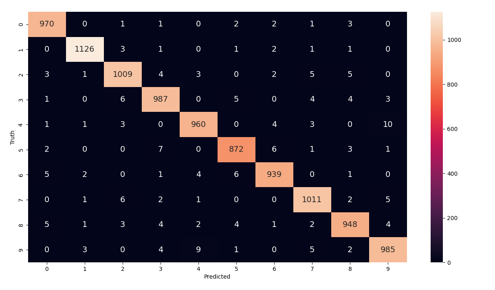

Training elements usign mnist
````Python
import tensorflow as tf
import matplotlib
import pandas as pd
import numpy as np
import matplotlib.pyplot as plt
from keras.datasets import fashion_mnist
from tensorflow.keras.models import Sequential
from tensorflow.keras.layers import Dense, Input, Activation
from tensorflow.keras.datasets import mnist
from tensorflow.keras.utils import to_categorical
from sklearn.model_selection import train_test_split
from matplotlib.ticker import (MultipleLocator, FormatStrFormatter)

# data validation
dataValidation = 10000

# code get data
(X_train_all, Y_train_all), (X_test, Y_test) = mnist.load_data()

# 60000 data all, 50000 for training and 10000 for validation
x_train = X_train_all[dataValidation:]
y_train = Y_train_all[dataValidation:]

x_val = X_train_all[:dataValidation]
y_val = Y_train_all[:dataValidation]

print(x_train.shape)
print(x_train.shape[0])

# show figure first three image
plt.figure(figsize=(10, 5))
plt.subplot(1, 3, 1)
plt.axis(True)
plt.imshow(x_train[0], cmap='gray')
plt.subplot(1, 3, 2)
plt.imshow(x_train[1], cmap='gray')
plt.subplot(1, 3, 3)
plt.imshow(x_train[2], cmap='gray')
plt.subplots_adjust(wspace=0.2, hspace=0.2)
plt.show()
print(x_train.shape)

# number imagen to convert (50000,784)
x_train = x_train.reshape((x_train.shape[0], 28 * 28))
x_train = x_train.astype("float32") / 255

x_test = X_test.reshape((X_test.shape[0], 28 * 28))
x_test = X_test.astype("float32") / 255

x_val = x_val.reshape((x_val.shape[0], 28 * 28))
x_val = x_val.astype("float32") / 255

# create model sequential
model = Sequential()
# add layer input 784 col
model.add(Dense(128, activation='relu', input_shape=(x_train.shape[1],)))
# add layer hidden
model.add(Dense(128, activation='relu'))
# layer output
model.add(Dense(10, activation='softmax'))
# summary model
model.summary()

# compile model, evalue metric accuracy
model.compile(optimizer='rmsprop',
              loss='categorical_crossentropy',
              metrics=['accuracy'])
# Convert integer labels to one-hot encoded vectors.
y_train = to_categorical(y_train)
y_val = to_categorical(y_val)
y_test  = to_categorical(Y_test)
# get training results
training_results = model.fit(
    x_train,
    y_train,
    epochs=100,
    batch_size=64,
    validation_data=(x_val, y_val)
)


# plot results
def plot_results(metrics, title=None, ylabel=None, ylim=None, metric_name=None, color=None):
    fig, ax = plt.subplots(figsize=(15, 4))

    if not (isinstance(metric_name, list) or isinstance(metric_name, tuple)):
        metrics = [metrics, ]
        metric_name = [metric_name, ]

    for idx, metric in enumerate(metrics):
        ax.plot(metric, color=color[idx])

    plt.xlabel("Epoch")
    plt.ylabel(ylabel)
    plt.title(title)
    plt.xlim([0, 20])
    plt.ylim(ylim)
    # Tailor x-axis tick marks
    ax.xaxis.set_major_locator(MultipleLocator(5))
    ax.xaxis.set_major_formatter(FormatStrFormatter('%d'))
    ax.xaxis.set_minor_locator(MultipleLocator(1))
    plt.grid(True)
    plt.legend(metric_name)
    plt.show()
    plt.close()


train_loss = training_results.history['loss']
train_acc = training_results.history['accuracy']
val_loss = training_results.history['val_loss']
val_accuracy = training_results.history['val_accuracy']

plot_results([train_loss, val_loss],
             ylabel='loss',
             ylim=[0.0, 0.5],
             metric_name=['Training Loss', 'Validation Loss'],
             color=['g', 'b'])

plot_results([train_acc, val_accuracy],
             ylabel='Accuracy',
             ylim=[0.9, 1],
             metric_name=['Training Accuracy', 'Validation Accuracy'],
             color=['g', 'b'])

model.save('model/model.h5')
print(x_test.shape)

# predice data xtest
predictions = model.predict(x_test)
index = 0
print(f"Number digit truth", Y_test[index])
print('\n')
print(f"Predictions for each Class: \n")
for i in range(10):
    print("digit", i, ' probability: ', predictions[index][i])

predictions = model.predict(x_test)
predicted_labels = [np.argmax(i) for i in predictions]
# convert one-hot enoded label to integers
y_test_integer_labels = tf.argmax(Y_test, axis=1)
# generate matrix confusion for the dataset
cm = tf.math.confusion_matrix(labels=y_test_integer_labels, predictions=predicted_labels)
# plot confusion matrix
plt.figure(figsize=[15, 8])
import seaborn as sn

sn.heatmap(cm, annot=True, fmt='d', annot_kws={'size': 14})
plt.xlabel('Predicted')
plt.ylabel('Truth')
plt.show()


````

Class Model load
````Python
import tensorflow as tf
import matplotlib
import pandas as pd
import numpy as np
from keras.models import load_model
import matplotlib.pyplot as plt
from keras.datasets import fashion_mnist
from tensorflow.keras.models import Sequential
from tensorflow.keras.layers import Dense, Input, Activation
from tensorflow.keras.datasets import mnist
from tensorflow.keras.utils import to_categorical
from sklearn.model_selection import train_test_split
from matplotlib.ticker import (MultipleLocator, FormatStrFormatter)

model = load_model('model/model.h5')

# code get data
(X_train_all, Y_train_all), (x_test, y_test) = mnist.load_data()

# number imagen to convert (50000,784)

x_test = x_test.reshape((x_test.shape[0], 28 * 28))
x_test = x_test.astype("float32") / 255
y_test  = to_categorical(y_test)


# predice data xtest
predictions = model.predict(x_test)
index = 0
print(f"Number digit truth", y_test[index])
print('\n')
print(f"Predictions for each Class: \n")
for i in range(10):
    print("digit", i, ' probability: ', predictions[index][i])

predictions = model.predict(x_test)
predicted_labels = [np.argmax(i) for i in predictions]
# convert one-hot enoded label to integers
y_test_integer_labels = tf.argmax(y_test, axis=1)
# generate matrix confusion for the dataset
cm = tf.math.confusion_matrix(labels=y_test_integer_labels, predictions=predicted_labels)
# plot confusion matrix
plt.figure(figsize=[15, 8])
import seaborn as sn

sn.heatmap(cm, annot=True, fmt='d', annot_kws={'size': 14})
plt.xlabel('Predicted')
plt.ylabel('Truth')
plt.show()


````

Result classification
